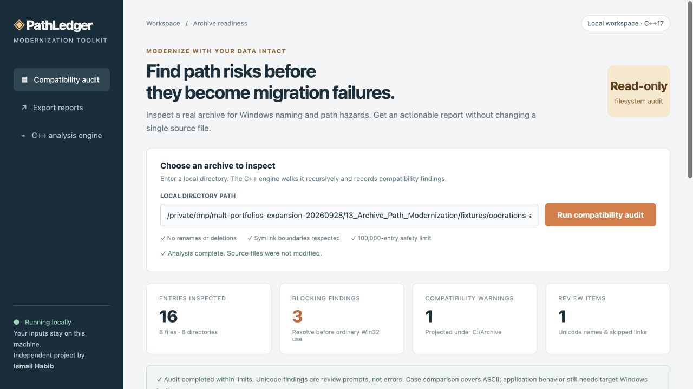
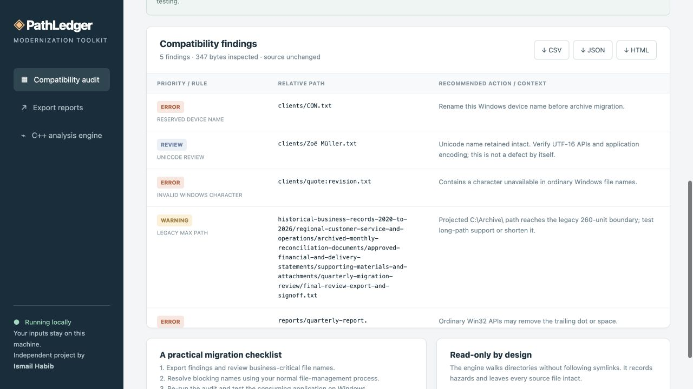

# PathLedger — Windows Archive Compatibility Audit

A working, read-only C++17 utility that inspects real folders, identifies covered Windows path risks and exports an actionable compatibility report.

## What it does

- Recursive filesystem audit with symlink boundaries and scan limits
- Windows reserved names, invalid characters, trailing dots/spaces and ASCII case/trim conflicts
- Projected legacy path-length checks and explicit Unicode review findings
- Local dashboard with downloadable JSON, CSV and standalone HTML reports

## Screenshots

Actual running application, captured with labelled synthetic test data.



The running local workspace accepts a real directory and explains the read-only audit scope.



Actual compiled-engine findings from the labeled synthetic archive, with names, rules and next-step guidance.

## Quick start — macOS / POSIX

Requirements: Python 3.10+ and a C++17 compiler (Apple Command Line Tools provides clang++). No Python packages, API keys or external services are required.

1. Open this project folder.
2. Double-click `Start.command`, or run `./run.sh` in a terminal.
3. Open http://127.0.0.1:8113 in your browser.
4. Replace the fixture path with your own directory and click **Run compatibility audit**.
5. Download CSV, JSON or HTML from the resulting report.
6. Stop the terminal process with Control-C when finished.

The start script compiles the C++ engine from source when needed. Build outputs are local and are excluded from this repository.

## Command-line use

```sh
mkdir -p runtime
c++ -std=c++17 -O2 -Wall -Wextra -Wpedantic src/pathledger.cpp -o runtime/pathledger
python3 generate_fixture.py
./runtime/pathledger "runtime/operations-archive"
```

The executable prints structured JSON to standard output; invalid input produces an error on standard error and a nonzero exit code.

## Verify

Build the engine with the command above before running the checks.

```sh
python3 -m unittest discover -s tests -v
# With the local server running:
python3 tests/http_checks.py
```

## Windows build path — unverified

CMakeLists.txt targets C++17 and includes MSVC /utf-8 and /W4 options. In a Visual Studio developer terminal, build using `cmake -S . -B build` followed by `cmake --build build --config Release`. Copy the resulting `pathledger.exe` into `runtime` and adjust the server engine filename for Windows, then start with `python server.py`. The C++ Windows entry point uses wide arguments before UTF-8 conversion. This configuration is supplied for further validation; it has not been compiled or run on Windows.

## Scope and limits

Independent new modernization-support tool; no historical client migration is claimed. Windows execution and MSVC compilation are not verified. ASCII case comparison is not full Windows Unicode case folding. Long-path checking assumes C:\Archive\; application-specific Windows validation remains required.

Safety limits: 100,000 entries, 64 directory levels, and 20,000 retained findings. Symlinks are recorded but never followed. A mutable tree may change during inspection; the audit is not an atomic snapshot. Directory permissions and enumeration errors are recorded where available. Root-relative paths are projected under a fixed C:\Archive\ destination. No automatic rename/copy/deletion is performed.

## Data handling

The server accepts only local browser requests and never sends input to external services. It accepts real local paths that the current user can read. Use this as a single-user local tool, not a public internet server. Generated reports and synthetic verification data are stored in `runtime`; deleting those generated files removes those local copies. The original inputs are never intentionally changed. Fixture data is synthetic and labeled.

## Portable source checkout and synthetic fixture

The archive fixture is represented by `fixtures/archive_manifest.json`, so the source checkout does not contain Windows-reserved names, trailing-dot filenames or very long nested fixture paths. On macOS/POSIX, `python3 generate_fixture.py` creates those deliberate compatibility cases under ignored `runtime/operations-archive/`. The normal server startup also prepares this fixture. Existing differing files and symlinked destinations are rejected instead of overwritten.

The fixture generator and filesystem tests require a POSIX filesystem capable of representing these names. They do not establish Windows compatibility. On Windows the generator exits with an explanatory error; the server skips fixture generation and must be pointed at your own directory after an appropriate Windows build. Windows/MSVC execution remains unverified.

## Project documentation

- [Case study](CASE_STUDY.md)
- [Recorded verification](TEST_RESULTS.md)
- [Screenshot captions](screenshots/CAPTIONS.md)

## License

[MIT](LICENSE) © 2026 Ismail Habib.
